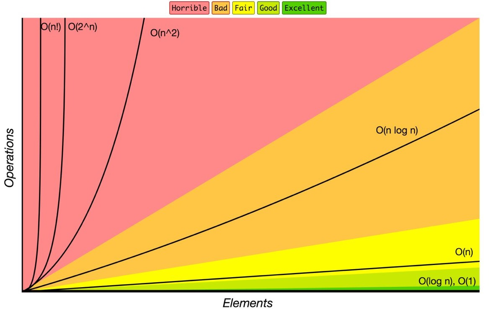

# Big O Notation
---
It describes how the performance of an algorithm scales with the size of the problem.

 may be **time to execute** or **amount of memory**.

Size must be a quantitative measure of the scale of the problem. For example:
- Number of items to sort.
- Number of nodes in a graph.

An everyday example would be `n` people shaking hands in a room where the **number of handshakes** is $O(n^2)$ and **time to shake hands** is $O(n)$.

## Performance Families

Classifications ordered by **decreasing** efficiency:
- Constant: O(1)
- Logarithmic: O($log_n$)
- Sublinear: O($n^d$) for d < 1
- Linear: O(n)
- Linearithmic: O($n log_n$)
- Quadratic: O($n^2$)
- Exponential: O($2^n$)
