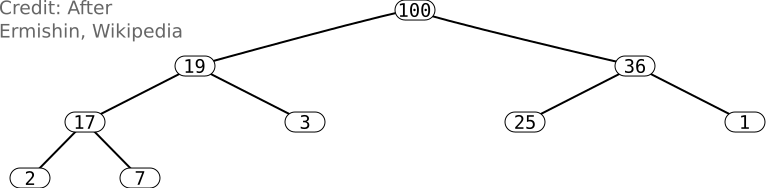
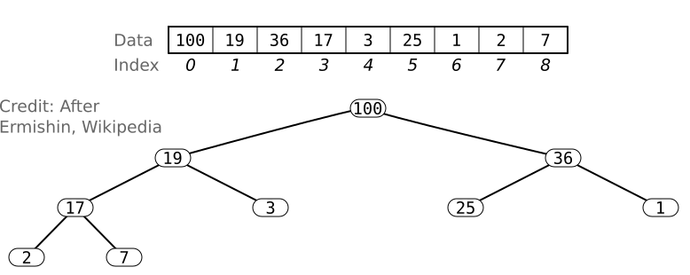

# Binary Heap
---
A binary heap is a form of [binary tree](binary-trees.md), with two additional properties:

- It is a **complete** binary tree, meaning that all levels of the tree (except possibly the last one) are full.
    - If not complete, the last level is filled from left to right.

- The data stored in each node is greater than or equal to the data in the node's **children**.
    - With the variant which is less than or equal.

## Binary Heap Representation
Use an array with **N** elements.

- Root at index 0.
- Children of node at index **i** at $2i+1$ and $2i + 2$
- Parent of node at index **i** at $floor((i-1)/2)$.

## Reference
- [Heapsort](heapsort.md)
