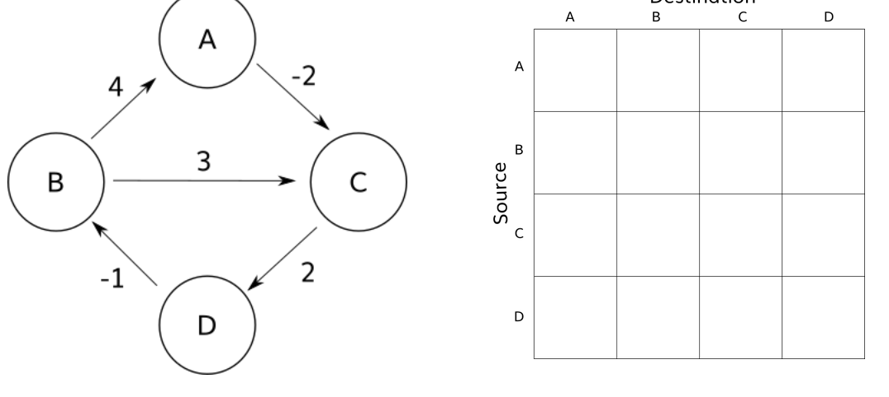
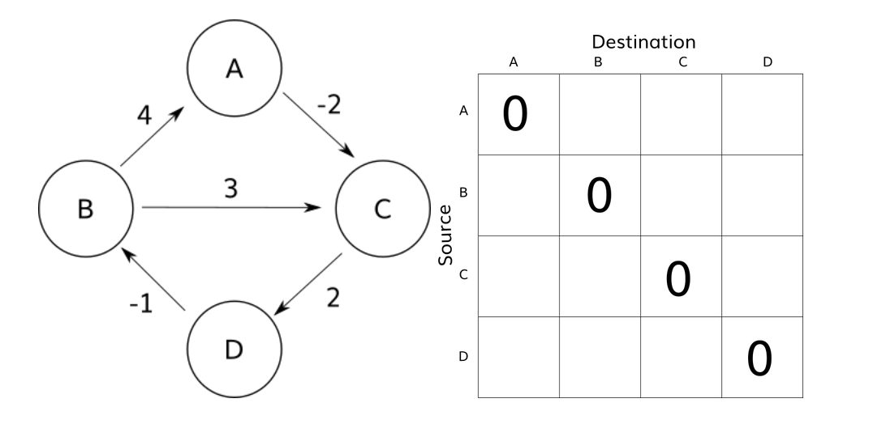
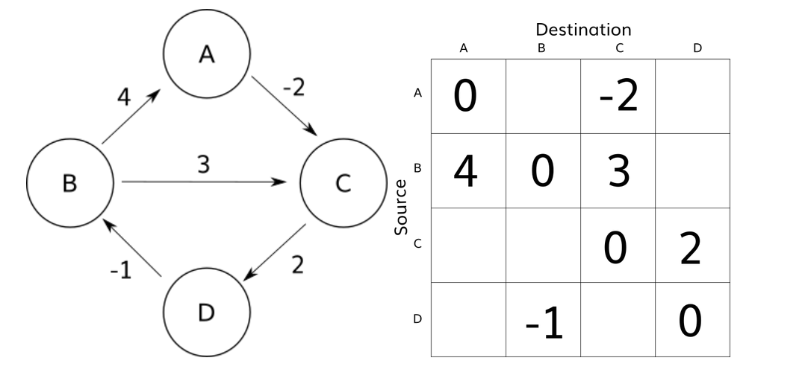

# Floyd-Warshall
---
It is a **shortest path** algorithm that calculates the shorted path between **all** pairs of vertices.

- Negative edges are allowed.
- No negative cycles.
- $O(V^3)$, where V is the number of vertices.

## Pseudo-code
```c
let V = number of vertices of graph
let dist[V][V] = 2D array of minimum distances (the answers)

for each vertex v
  dist[V][V] <- 0

for each edge (u, v)
  dist[u][V] <- weight(u,V)

for k from 1 to V
  for i from 1 to V
    for j from 1 to V
      if dist[i][j] > dist [i][k] + dist[k][j]
       dist[i][j] <- dist[i][k] + dist[k][j]
```

## Example
Here is a graph with four vertices (V = 4) and `dist[4][4]`:


```c
for each vertex v
  dist[v][v] <- 0
```


```c
for each edge (u,v)
  dist[u][v] <- weight(u,v)
```


```c
for k from 1 to V
  for i from 1 to V
    for j from 1 to V
    if dist[i][j] > dist[i][k] + dist[k][j]
      dist[i][j] <- dist[i][k] + dist[k][j]
```

If k = A, i = A and j = A:
```c
dist[i][j] > dist[i][k] + dist[k][j]
dist[A][A] > dist[A][A] + dist[A][A]
    0      >     0      +     0
```

This statement is **false**. Therefore, `dist` does not get updated:


If k = A, i = A and j = B then there is not yet a value for A->B. It is assumed to be infinite:
```c
dist[i][j] > dist[i][k] + dist[k][j]
dist[A][B] > dist[A][A] + dist[A][B]
 infinity  >     0      +  infinity
```

This statement is **false**. Therefore, `dist` does not get updated.


If k = A, i = B and j = C:
```c
dist[i][j] > dist[i][k] + dist[k][j]
dist[B][C] > dist[B][A] + dist[A][C]
    3      >     4      +    -2
```

This statement is **true**. Therefore, `dist` gets updated:


## See also
- [Dijkstra](notes/dijkstra-algorithm.md)
- [Graphs](notes/graphs.md)
- [Big O Notation](notes/big-o-notation.md)
