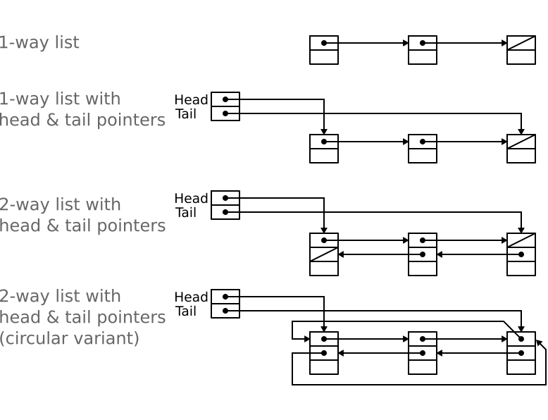

# Lists
---


## Lists in C
```c
struct elem {
  struct elem *next;
  int val;
};
```

```c
struct elem
  struct elem *next;
  struct elem *head;
  int val;
};
```

```c
struct elem *head = NULL;
struct elem *tail = NULL;
```
