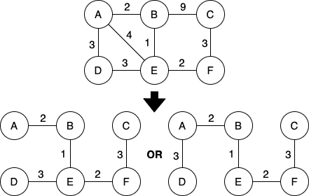

# Minimum Spanning Subtree
---
It is a subtree with the minimum possible edge weight that connects all nodes together.

There must exist **no cycles** in the subtree.

The two most popular algorithms are [Kruskal's](kruskals-algorithm.md) and [Pimm's](pimms-algorithm.md).

A graph **can** have multiple minimum spanning subtrees:

## See also
- [Trees](trees.md)
- [Graphs](graphs.md)
