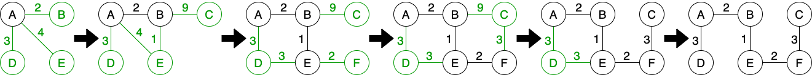

# Pimm's Algorithm
---
It is a [minimum spanning subtree](notes/minimum-spanning-subtree.md) algorithm.

It scales well, fast with dense [graphs](notes/graphs.md).

It has a  of $O_{E\ log\ N}$ with [binary heap](notes/binary-heap.md) and $O_{E\ +\ log\ N}$ with Fibonacci heap.

It works like this:
1. Choose any node.
2. Choose nearest node that is not included in the spanning subtree formed so far.
3. Repeat step 2 until all nodes are included in the subtree.

## See also
- [Minimum Spanning Subtree](notes/minimum-spanning-subtree.md)
- [Trees](notes/trees.md)
- [Graphs](notes/graphs.md)
- [Big O Notation](notes/big-o-notation.md)
- [Kruskal's](notes/kruskals-algorithm.md)
